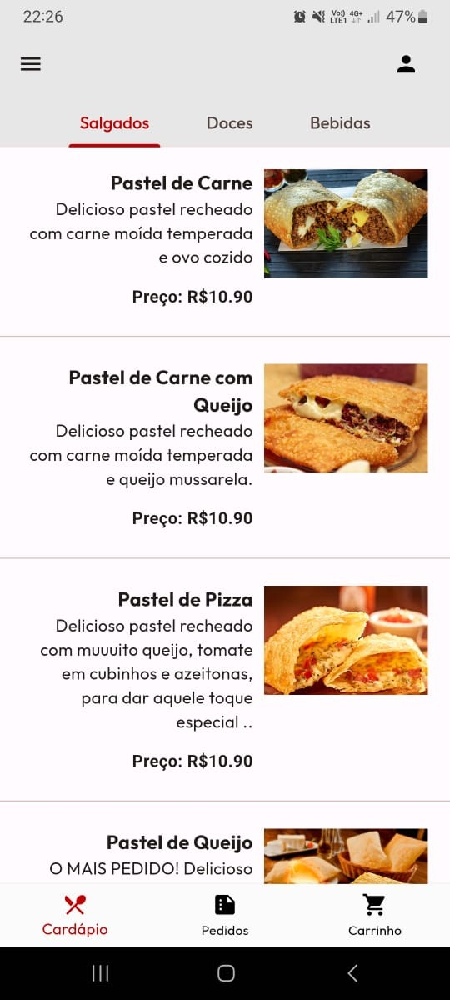
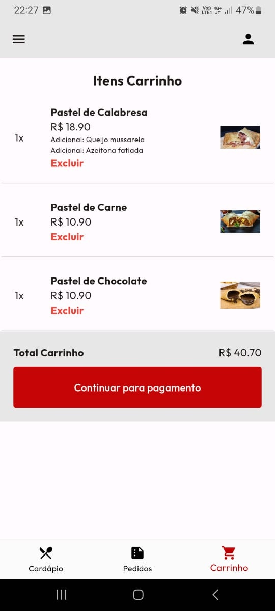

<div align="center">
    
    <br>
    <b>Ponto do Pastel</b>
    <br>
    <span>Um aplicativo delivery de pastel</span>
</div>


## Overview

Ponto do Pastel é uma aplicativo delivery mobile desenvolvido em Flutter, e que faz parte de um Projeto Acadêmico da Universidade de Sorocaba  - Uniso.

O projeto tem como objetivo simular um app delivery com a temática "Pastelaria", e suas principais funcionalidades: 
- [x] Cadastro na no aplicativo
- [x] Login no aplicativo
- [x] Lista de produtos por categorias
- [x] Carrinho de compras
- [x] Processo de compra do pedido
- [x] Lista de pedidos já realizados
- [x] Perfil do usuário


Este projeto está divido em 3 partes (repositórios):
- [x] 1° é o app delivery (Este repositório)
- [x] 2° é o gerenciamento web que foi desenvolvido para gerenciar os pedidos realizados no app, saiba mais [clicando aqui](https://github.com/WesleyRodrigues55/web-management-system-ponto-do-pastel), e o
- [x] 3° é o back-end que foi responsável pela criação das APIs para comunicação entre os dois softwares (app e web), pode saber mais sobre [clicando aqui](https://github.com/WesleyRodrigues55/backend-delivery-ponto-do-pastel)

## Getting Started

Para o teste do app é necessário que pelo menos o back-end seja configurado e utilizado, pois 80% do app depende das requisições HTTP ao back-end. Então antes de iniciar a simulação com o app, clone e configure o back-end, pode saber mais sobre o back-end do projeto [clicando aqui](https://github.com/WesleyRodrigues55/backend-delivery-ponto-do-pastel).

Configurando e instalando o projeto Flutter (Se baseando no uso do VS Code como IDE).
"Vou considerar que quem esteja seguindo este tutorial entenda como funciona a configuração inicial do Android Studio"

1. Tenha em sua máquina as seguintes IDEs instaladas:
- [x] Visual Studio Code
- [x] Android Studio.

É necessário ter ambas, pois precisa realizar configurações iniciais para qualquer projeto que use emulador.

2. Faça o Download do Flutter e instale suas dependências [clicando aqui](https://docs.flutter.dev/get-started/install) (as configurações de download mudam para cada máquina e SO, então se atente as configurações de sua máquina e escolha o download correto)

3. Com o flutter instalado, abra seu VS Code e instale as extensões:
- [x] [Dart](https://marketplace.visualstudio.com/items?itemName=Dart-Code.dart-code)
- [x] [Flutter](https://marketplace.visualstudio.com/items?itemName=Dart-Code.dart-code)

4. Após a instalação das extenções, execute o seguinte comando em seu terminal:

    ```sh
    flutter doctor
    ```
Este comando será responsável por analisar e te retornar as dependências necessários para a emulação de algum dispositivo em sua máquina.

5. Com as configurações inicias do projeto feitas, vamos realizar a clonagem do repositório.
    ```sh
    git clone https://github.com/WesleyRodrigues55/app-delivery-ponto-do-pastel.git
    ```

6. Em seguida, abra o projeto.
    ```sh
    cd app-delivery-ponto-do-pastel
    ```

7. Instale as dependências do `pubspec.yaml` rodando o comando:
    ```sh
    flutter pub get
    ```

8. Agora precisamos rodar a aplicação e escolher quais dispositivo emular, pra isso, execute o comando:
    ```sh
    flutter run
    ```

Tudo dando certo, o app será executado e abrirá sua tela inicial "Página de Login", agora é necessário o uso do backend e configuração dos apontamentos dos links de requisição.

## Project Images

<div align="center">
    
    
    
</div>


## Contributors

[](https://github.com/WesleyRodrigues55)
[](https://github.com/Encattani)
[](https://github.com/marilialloureiro)
[](https://github.com/joaooliveira376)
[](https://github.com/lucassuzuki)